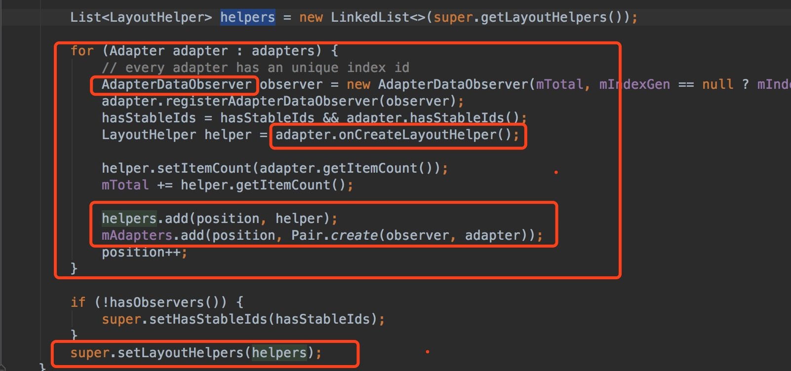

在上一篇介绍了[vlayout的使用](http://blog.csdn.net/vroymond/article/details/71258292)，在这篇我们去研究vlayout的源码以及思路。

###概括
当我们使用RecylerView时，需要绑定一个Adapter和LayoutManager，而vlayout里就自定义了VirtualLayoutAdapter和VirtualLayoutManager来绑定到RecyclerView，并定义了LayoutHelper提供每个item的布局方式，而VirtualLayoutManager管理一系列的LayoutHelper。


###思路流程

1.定义的**VirtualLayoutAdapter**和**VirtualLayoutManager**来绑定到RecyclerView(**DelegateAdapter**是继承VirtualLayoutAdapter)


2.**VirtualLayoutAdapter**内部定义了一个构造方法负责接收VirtualLayoutManager的实例，以及两个接口：

- getLayoutHelpers()——用于返回某个位置组件对应的一个LayoutHelper；

- setLayoutHelpers()——业务方调用此方法设置整个页面所需要的一系列LayoutHelper。

实际调用交由**VirtualLayoutManager**中完成。


3.**VirtualLayoutManager**继承Recyleview的**LinearLayoutManager**，**VirtualLayoutManager**持有一个**LayoutHelperFinder**类，当RecylerView滑动时或者加载布局的时候，就会调用V**irtualLayoutManager**中的**layoutChunk**方法，再调用LayoutHelperFinder中的**getLayoutHelper**方法去折半查找到当前所在位置的helper类。


4.让**LayoutHelper**去实现具体布局逻辑

**LayoutHelper**是负责布局具体实现逻辑的一个接口类，主要实现交由子类实现。主要接口

- doLayout(实现布局逻辑接口）
- beforeLayout(布局之前方法)
- afterLayout(布局之后需要实现的方法)
- isOutOfRange(告诉**VirtualLayoutManager**当前所在区域是否超出当前LayoutHelper控制范围)
- setRange方法设置当前所在位置。

5.开始布局dolayout，不同helper实现不同的布局逻辑。代码中抽取了BaseHelper类。在dolayout中调用抽象方法layoutViews，让子类实现。


###layoutHelper绑定过程
首先看下如何使用Helper类:（比如使用FloatLayoutHelper）

```Java
FloatLayoutHelper layoutHelper = new FloatLayoutHelper();
layoutHelper.setAlignType(FixLayoutHelper.BOTTOM_RIGHT);
layoutHelper.setDefaultLocation(100, 400);
VirtualLayoutManager.LayoutParams layoutParams = new VirtualLayoutManager.LayoutParams(150, 150);
adapters.add(new MyAdapter(this, layoutHelper, 1, layoutParams));
delegateAdapter.addAdapters(adapters);
```

**DelegateAdapter**继承自**VirtualLayoutAdapter**

**MyAdapter**是继承自DelegateAdapter内部的Adapter。里面有两个方法：

1. onCreateLayoutHelper  绑定指定的helper帮助类
2. onBindViewHolderWithOffset	跟onBindViewHolder方法一样，多了个参数offsetTotal，参数为item对应实际位置。


大致流程：给不同位置的item设置不同的adapter，adapter是继承自**DelegateAdapter**内部的Adapter，以此绑定对应位置的layoutHelper

具体流程：

1.**DelegateAdapter**内部有个接收adapter集合的方法addAdapters。


2.在**addAdapters**方法中，遍历传进来的adapters集合，并创建一个layoutHelper集合，调用每个adapter的onCreateLayoutHelper方法接收对应位置的layoutHelper。



3.在**addAdapters**方法中创建并添加完layoutHelper集合，最终调用父类**VirtualLayoutAdapter**的setLayoutHelper，并把layoutHelper集合传过去。

###布局流程
首先我们看下vlayout作者的一个布局流程时序图。


RecylerView出现空白区域的时候，加载item，这个过程其实就是RecylerView本身的一个绘制流程。

android控件绘制流程分为三个步骤：测量(onMesure)，布局(onLayout)，绘制(onDraw)。而在RecylerView中测量以及布局过程就委托layoutManager去处理。也就是我们vlayout发挥作用的时候了。

首先我们看下RecylerView的onMesure方法。


里面中mlayout指代的就是**layoutManager**，我们可以看到RecylerView的测量方法交由layoutManager去实现。

我们往下看到方法为**dispatchLayoutStep2()** 


里面的onLayouchidren方法就是layoutManager布局item的过程。

到现在我们大概了解了layoutManager是如何接手RecylerView测量以及布局过程，现在我们来看下vlayout是如何做处理的。

valyout中**VirtualLayoutManager**底层是继承实现的RecylerView的LinearLayoutManager


上面说到onLayoutChildren是layoutManager的方法，看**VirtualLayoutManager**中是如何处理。

<br/>

####布局前置动作(runPreLayout)
通过让**LayoutHelperFinder**去遍历查找对应的helper,实现相应的beforeLayout方法
清理一些不可见的item。


####布局
触发父类**ExposeLinearLayoutManagerEx**的**onLayoutChildren**方法，期中有个方法fill是填充item的。


fill方法作用是填充itemView，其中触发的是**layoutChunk**方法。


在layoutChunk方法中让**LayoutHelperFinder**去遍历查找对应的helper,实现相应的dolayout方法


####布局后完成动作
让**LayoutHelperFinder**去遍历查找对应的helper,完成相应的afterLayout方法，重制item位置、添加item背景等操作。


###结束

如果想了解vlayout源码的同学可以点击[github地址](https://github.com/alibaba/vlayout)。


